### 引言

> 本文主要从autopilot入手，解释了什么是容器化的NodeJs微服务、NodeJs微服务所利用的技术栈，
并对这些技术进行了解释和说明。

通过梳理jsconf中Wyatt Preul 分享的NodeJS Microservices on Autopilot的PPT，理清了什么是容器化的微服务。
当前的各类应用的服务中，后端的服务及业务逻辑之间是相互依赖的，而且服务也非常复杂，子服务之间相互的耦合比较高，那么在实际的应用中
可能会出现这样的场景，前端发起请求，然后请求超时，这时系统会爆出500出来，这时应用会一步步反馈当前的情况给后端运维人员，而这个过程是漫长的。。

遇到上述的场景，我们想，过载的服务是否可以返回503状态码，同时负载均衡应该可以降低服务的分发任务，如何才能让请求超时的应用知道其他可用的服务并且在下一次请求可以成功。

### 什么是Autopilot Pattern

autopilot的理念是将一个个的服务包装在containerPilot中，而每一个containerPilot都有一个docker Container容器。
各个服务通过nginx等负载均衡来管理，最终通过`consul`来实现多数据分布式共享。

在应用还没有开发完毕时，我们想可以很简单的对其进行构建、测试、部署以及下线。在开发中，我们希望应用可以被一键部署和下线，
应用和工作流程能被自动化测试、应用和工作流能直接执行在我们的pc上如在云上一样、应用之间的关系应该是解耦的。

利用Autopilot可以很容易实现部署和下线。通过Autopilot可以自动化执行不必要的东西，只保留必要的操作；
通过自动执行这些操作任务，使得应用程序保持在同一个版本中，提高了可见性。但最重要的是，这些应用程序是可以跨平台的。

Autopilot Pattern 的特性：

* 可以离线的开发；
* 开发到部署完全自动化、可重复的工作流程自动化；
* 运行在单个容器中的应用程序，相互解耦
* 可以根据业务量需求，弹性的增加微服务的数量
* 动态更新反向代理配置等

Autopilot ContainerPilot：

ContainerPilot会定时进行health check 来监控容器中服务的运行情况，一旦onChange就告知consul。生命周期如下图所示：
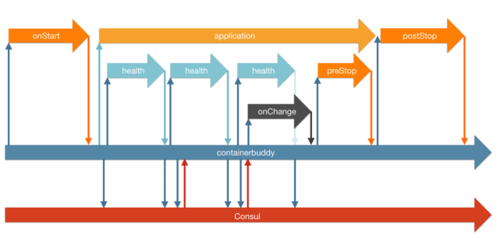

参考文档：[Autopilot Pattern Applications](http://autopilotpattern.io/)

### NodeJs微服务技术栈

在Wyatt Preul分享的ppt示例中，有这样一副图，如下。图中用到了很多新的技术栈。包括下面几个方面：

* [Docker](https://www.docker.com/) 
* [Consul](https://www.consul.io/)
* [Træfɪk](https://docs.traefik.io/)
* [NATS](https://github.com/devfacet/natsboard)
* [Prometheus](https://prometheus.io)
* [InfluxDB](https://github.com/influxdata/influxdb)
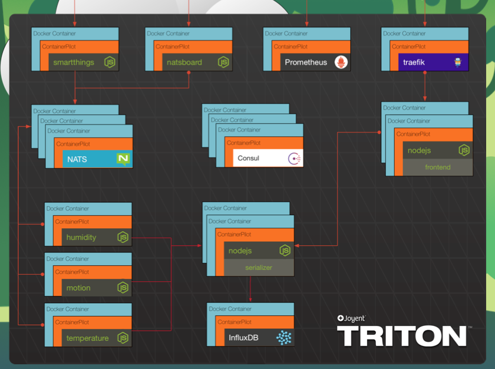

图中带有Node标识的都是一个个的应用服务，其余的是示例中所用到一些网络及数据服务。并且这些服务都包在一个个的docker的容器中。
下面我们将介绍上述相关的技术。可能偏向devOps了，所以没有深入了解，只当普及一下知识面。

##### Docker

1.什么是Docker？

> Docker 使用 Google 公司推出的 Go 语言 进行开发实现，基于 Linux 内核的 cgroup，namespace，以及 AUFS 类的 Union FS 等技术，对进程进行封装隔离，属于操作系统层面的虚拟化技术。由于隔离的进程独立于宿主和其它的隔离的进程，因此也称其为容器。
Docker 在容器的基础上，进行了进一步的封装，从文件系统、网络互联到进程隔离等等，极大的简化了容器的创建和维护。使得 Docker 技术比虚拟机技术更为轻便、快捷。如下图。
传统虚拟化和Docker的不同之处在于传统的虚拟化技术，会运行一套完整的操作系统。

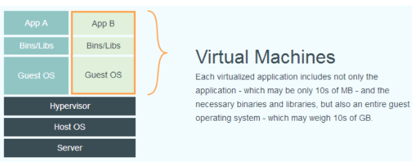
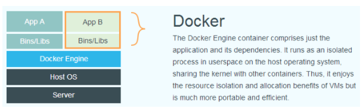

本文的示例源码中，用到了很多docker的知识，设计镜像定制、容器操作、health check、端口暴露等,这里不作展开，感兴趣的自行查看文档。

参考文档：[docker](https://yeasy.gitbooks.io/docker_practice/introduction/)

##### Consul

1.什么是Consul？

> Consul 是一个支持多数据中心分布式高可用的服务发现和配置共享的服务软件,由 HashiCorp 公司用 Go 语言开发, 基于 Mozilla Public License 2.0 的协议进行开源. Consul 支持健康检查,并允许 HTTP 和 DNS 协议调用 API 存储键值对.

2.Consul的使用场景

* docker 实例的注册与配置共享
* coreos 实例的注册与配置共享
* vitess 集群
* SaaS 应用的配置共享
* 与 confd 服务集成，动态生成 nginx 和 haproxy 配置文件

3.Consul 的优势

* 使用 Raft 算法来保证一致性, 比复杂的 Paxos 算法更直接. 相比较而言, zookeeper 采用的是 Paxos, 而 etcd 使用的则是 Raft.
* 支持多数据中心，内外网的服务采用不同的端口进行监听。 多数据中心集群可以避免单数据中心的单点故障,而其部署则需要考虑网络延迟, 分片等情况等. zookeeper 和 etcd 均不提供多数据中心功能的支持.
* 支持健康检查. etcd 不提供此功能.
* 支持 http 和 dns 协议接口. zookeeper 的集成较为复杂, etcd 只支持 http 协议.
* 官方提供web管理界面, etcd 无此功能.

4.Consul 的角色

>client: 客户端, 无状态, 将 HTTP 和 DNS 接口请求转发给局域网内的服务端集群.
 server: 服务端, 保存配置信息, 高可用集群, 在局域网内与本地客户端通讯, 通过广域网与其他数据中心通讯. 每个数据中心的 server 数量推荐为 3 个或是 5 个.

##### Træfɪk

>Træfɪk 是一个为了让部署微服务更加便捷而诞生的现代HTTP反向代理、负载均衡工具。 它支持多种后台 (Docker, Swarm, Kubernetes, Marathon, Mesos, Consul, Etcd, Zookeeper, BoltDB, Rest API, file…) 来自动化、动态的应用它的配置文件设置。
主要作用是在多个Docker container 中实现负载均衡的，支持反向代理动态配置热更新如下图。

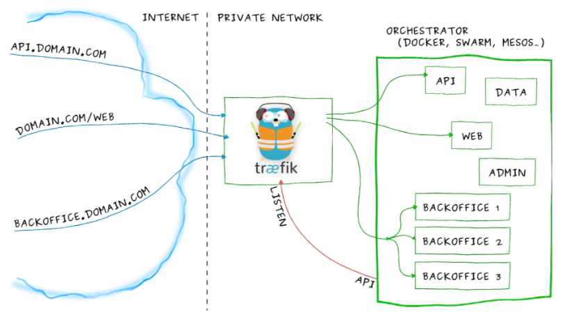

参考中文文档：[Træfɪk](https://docs.traefik.cn/)
参考英文文档：[Træfɪk](https://docs.traefik.io/)

##### NATS

主要是提供一套即时的NAT server监控dashboard。详见[github](https://github.com/devfacet/natsboard)

##### Prometheus

1.什么是 Prometheus？

>Prometheus是一套开源的监控&报警&时间序列数据库的组合，起始是由SoundCloud公司开发的。
google SRE的书内也曾提到跟他们BorgMon监控系统相似的实现是Prometheus。现在最常见的Kubernetes容器管理系统中，通常会搭配Prometheus进行监控。

2.Prometheus 的优点

* 非常少的外部依赖，安装使用超简单
* 已经有非常多的系统集成 例如：docker HAProxy Nginx JMX等等
* 服务自动化发现
* 直接集成到代码
* 设计思想是按照分布式、微服务架构来实现的

3.Prometheus 特性

* 自定义多维度的数据模型
* 非常高效的存储 平均一个采样数据占 ~3.5 bytes左右，320万的时间序列，每30秒采样，保持60天，消耗磁盘大概228G。
* 强大的查询语句
* 轻松实现数据可视化

4.系统架构

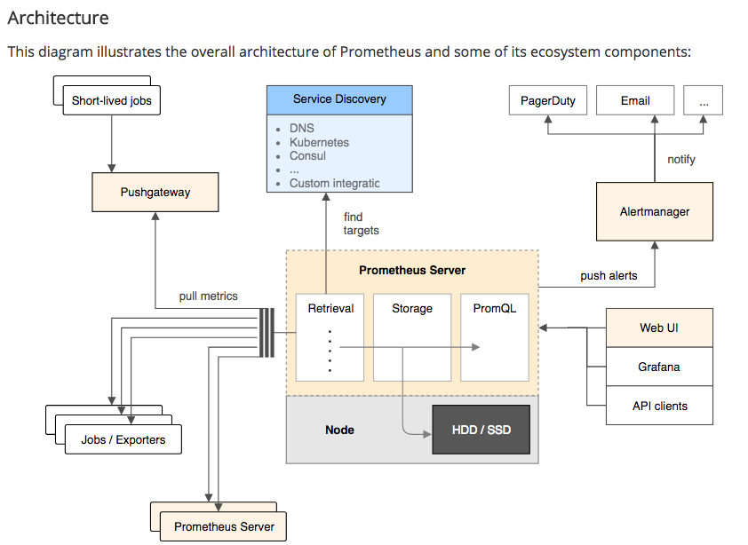

服务过程: Prometheus daemon 负责定时去目标上pull metrics(指标) 数据，每个pull目标需要暴露一个http服务的接口给它定时抓取。
Prometheus支持通过配置文件、Consul、DNS、kubernetes等方式指定抓取目标。
Alertmanager 是独立于Prometheus的一个组件，可以支持Prometheus的查询语句，提供十分灵活的报警方式。
Prometheus支持很多方式的图表可视化，例如Grafana，自带的Promdash，以及自身提供的模版引擎等等，还提供HTTP API的查询方式，自定义所需要的输出。
PushGateway这个组件是支持Client主动推送 metrics 到PushGateway，而Prometheus只是定时去Gateway上抓取数据。

参考文档：[Prometheus](https://prometheus.io/docs/introduction/overview/)

##### InfluxDB

>Influxdb是一个开源的分布式时序、时间和指标数据库，使用go语言编写，无需外部依赖。自带管理工具，支持sql查询，非常适合存储指标、事件、分析等数据。

三大特性：
* 时序性（Time Series）:与时间相关的函数的灵活使用（诸如最大、最小、求和等);
* 度量（Metrics）:对实时大量数据进行计算;
* 事件（Event）:支持任意的事件数据，换句话说，任意事件的数据我们都可以做操作;

有兴趣的可以看文档：[InfluxDB](https://docs.influxdata.com/influxdb/v1.3/)

### 示例代码实践

首先安装[docker for mac](https://docs.docker.com/docker-for-mac/install/) ,否则无法运行示例。（示例的使用说明有误，localhost:10001没有对外发布，对内的，localhost就好）

示例代码：[nodeJS-MicroServices-example](https://github.com/autopilotpattern/nodejs-example)

相关展示界面如下：

localhost:8080  =>  Traefik
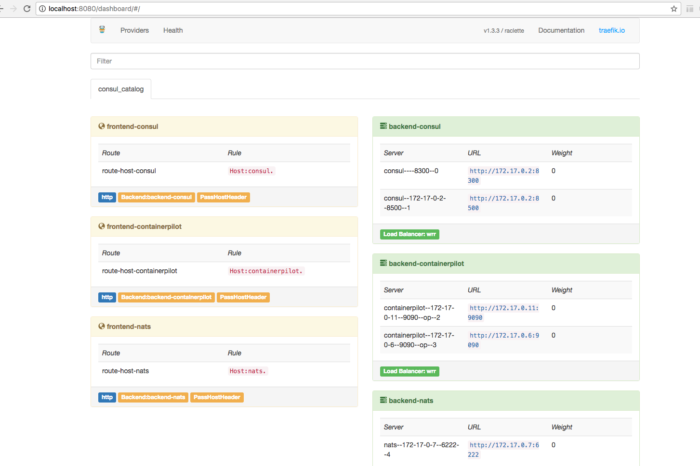

localhost:3000 => Nats
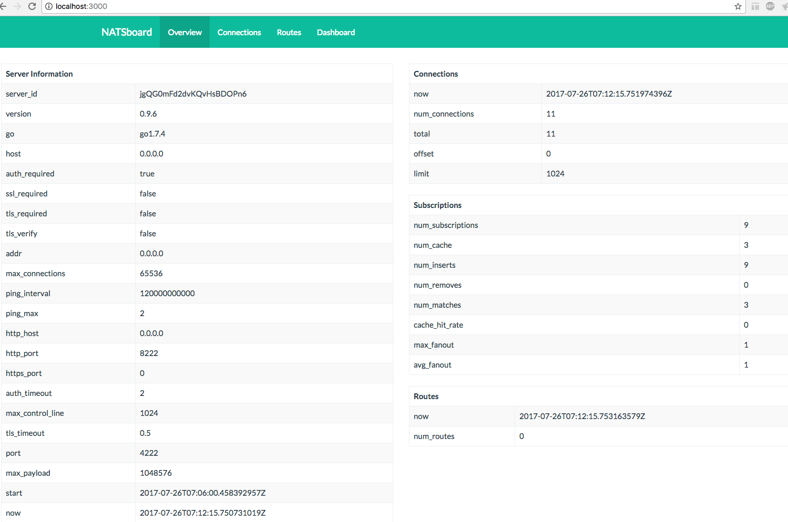

localhost:8083  =>InfluxDB
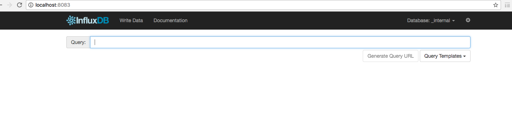

localhost:8500 => Consul
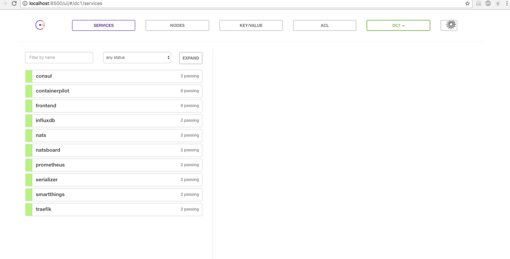

localhost:9090 => Prometheus
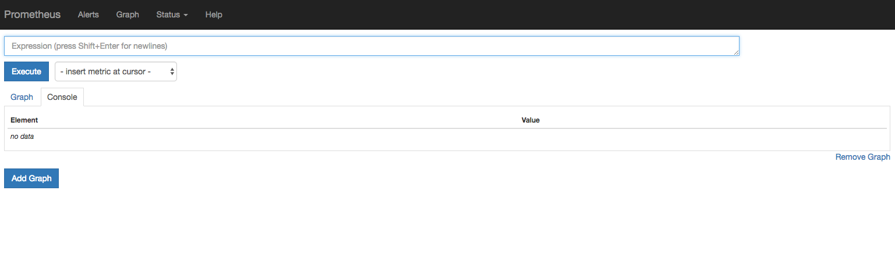

localhost => 示例中NodeJS本身的应用服务
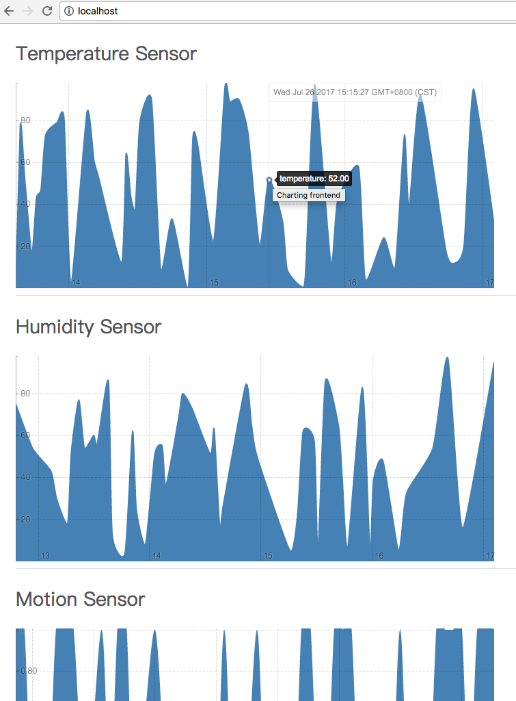

在docker中通过kitematic 可以管理、监控各个服务的运行情况.

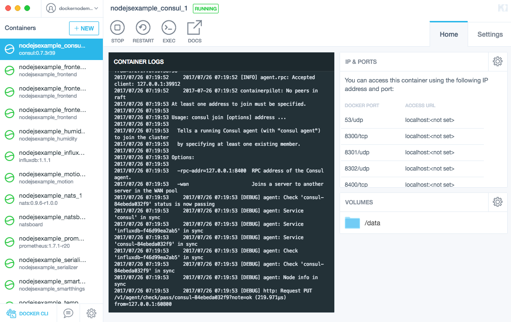
